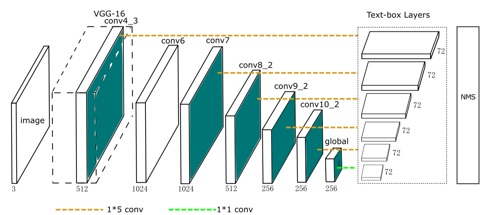

# TextBoxes:A Fast Text Detector with a Single Deep Neural Network, in PyTorch
A [PyTorch](http://pytorch.org/) re-implementation of [TextBoxes](https://arxiv.org/abs/1611.06779) from the AAAI2017 paper by Minghui Liao, Baoguang Shi, Xiang Bai, Xinggang Wang, Wenyu Liu.  The official and original Caffe code can be found [here](https://github.com/MhLiao/TextBoxes).



### Table of Contents
- <a href='#installation'>Installation</a>
- <a href='#datasets'>Datasets</a>
- <a href='#training-ssd'>Train</a>
- <a href='#evaluation'>Evaluate</a>
- <a href='#performance'>Performance</a>
- <a href='#demos'>Demos</a>
- <a href='#todo'>Future Work</a>
- <a href='#references'>Reference</a>


## Installation
- Install [PyTorch](http://pytorch.org/) by selecting your environment on the website and running the appropriate command.
- Clone this repository.
  * Note: We currently only support Python 3+(Test on Python 3.6.8).
  * PyTorch 0.4.1+(Test on PyTorch 1.2)
- Then download the dataset by following the [instructions](#datasets) below.
- We now support [tensorboardX](https://tensorboardx.readthedocs.io/en/latest/index.html) for real-time loss visualization during training!
  * To use tensorboardX in the browser:
  ```Shell
  # First install Python server and client
  pip install tensorboardX
  # Start the server (probably in a screen or tmux)
  tensorboard --logdir=run/experiments_*
  ```
  * Then (during training) navigate to http://localhost:6006/ (see the Train section below for training details).
- Note: For training, we currently support [ICDAR2013](https://rrc.cvc.uab.es/?ch=2&com=tasks#TextLocalization), [ICDAR2015](https://rrc.cvc.uab.es/?ch=4&com=tasks#TextLocalization), [ICDAR2017](https://rrc.cvc.uab.es/?ch=9&com=tasks) and [COCO_TEXT](https://vision.cornell.edu/se3/coco-text-2/).

## Datasets
To make things easy, we provide bash scripts to handle the dataset downloads and setup for you.  We also provide simple dataset loaders that inherit `torch.utils.data.Dataset`, making them fully compatible with the `torchvision.datasets` [API](http://pytorch.org/docs/torchvision/datasets.html).


### ICDAR

Download the ICDAR datasets from the above website and extract the files with commands like  `unzip xxx.zip -d train_images`, and you should have the following file structure.

```
ICDAR
├── ICDAR2013
│   ├── Challenge2_Test_Task12_Images.zip
│   ├── Challenge2_Test_Task1_GT.zip
│   ├── Challenge2_Training_Task12_Images.zip
│   ├── Challenge2_Training_Task1_GT.zip
│   ├── test_annos
│   ├── test_images
│   ├── train_annos
│   └── train_images
├── ICDAR2015
│   ├── Challenge4_Test_Task1_GT.zip
│   ├── ch4_test_images.zip
│   ├── ch4_training_images.zip
│   ├── ch4_training_localization_transcription_gt.zip
│   ├── test_annos
│   ├── test_images
│   ├── train_annos
│   └── train_images
└── ICDAR2017
    ├── ch9_test_images.zip
    ├── ch9_training_images.zip
    ├── ch9_training_localization_transcription_gt.zip
    ├── ch9_validation_images.zip
    ├── ch9_validation_localization_transcription_gt.zip
    ├── test_images
    ├── train_annos
    ├── train_images
    └── val_images
```

### COCO_Text

```
coco2014
├── annotations
│   └── COCO_Text.json
└── images
    └── train2014
```

## Training TextBoxes
- First download the fc-reduced [VGG-16](https://arxiv.org/abs/1409.1556) PyTorch base network weights at:              
  https://s3.amazonaws.com/amdegroot-models/vgg16_reducedfc.pth
- By default, we assume you have downloaded the file in the `weights` dir

```Shell
mkdir weights
cd weights
wget https://s3.amazonaws.com/amdegroot-models/vgg16_reducedfc.pth
```

- To train SSD using the train script simply specify the parameters listed in `train.py` as a flag or manually change them.

```Shell
python train.py
```

- Note:
  * For training, an NVIDIA GPU is strongly recommended for speed.
  * You can pick-up training from a checkpoint by specifying the path as one of the training parameters (again, see `train.py` for options)

## Evaluation
To evaluate a trained network:

```Shell
python eval.py
```

You can specify the parameters listed in the `eval.py` file by flagging them or manually changing them.  


## Performance
* **TODO**

## Demos

### Use a pre-trained SSD network for detection

#### Download a pre-trained network
- We are trying to provide PyTorch `state_dicts` (dict of weight tensors) of the latest SSD model definitions trained on different datasets.  
- Currently, we provide the following PyTorch models:
    * SSD300 trained on IC15 (newest PyTorch weights)
      - **TODO**
    * SSD300 trained on IC17 (original Caffe weights)
      - **TODO**
- Our goal is to reproduce this table from the [original paper](https://arxiv.org/abs/1611.06779)


### Try the demo notebook
- Make sure you have [jupyter notebook](http://jupyter.readthedocs.io/en/latest/install.html) installed.
- Two alternatives for installing jupyter notebook:
    1. If you installed PyTorch with [conda](https://www.continuum.io/downloads) (recommended), then you should already have it.  (Just  navigate to the ssd.pytorch cloned repo and run):
    `jupyter notebook`

    2. If using [pip](https://pypi.python.org/pypi/pip):

```Shell
# make sure pip is upgraded
pip3 install --upgrade pip
# install jupyter notebook
pip install jupyter
# Run this inside ssd.pytorch
jupyter notebook
```

- Now navigate to `demo/demo.ipynb` at http://localhost:8888 (by default) and have at it!

### Try the webcam demo
- Works on CPU (may have to tweak `cv2.waitkey` for optimal fps) or on an NVIDIA GPU
- This demo currently requires opencv2+ w/ python bindings and an onboard webcam
  * You can change the default webcam in `demo/live.py`
- Install the [imutils](https://github.com/jrosebr1/imutils) package to leverage multi-threading on CPU:
  * `pip install imutils`
- Running `python -m demo.live` opens the webcam and begins detecting!

## TODO
We have accumulated the following to-do list, which we hope to complete in the near future
- Still to come:
  * [x] Support for the ICDAR dataset
  * [x] Support for the COCO_TEXT dataset
  * [ ] Support for text detection evluation method
  * [ ] Support for input size 512 training and testing
  * [ ] Support for training on custom datasets

## Authors
I hope we could do this
* [**Fantasy**](https://github.com/FantasyJXF)
* [**Lu Zhang**](https://github.com/zhangluustb)

***Note:*** Unfortunately, this is just a hobby of ours and not a full-time job, so we'll do our best to keep things up to date, but no guarantees.  That being said, thanks to everyone for your continued help and feedback as it is really appreciated. We will try to address everything as soon as possible.

